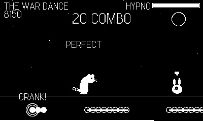

# Weasel War Dance

A rhythm game for Playdate about the mustelid family's greatest trick:
stoats and weasels really do perform a frenzied "war dance" that seems
to mesmerize their prey. Here, that dance has a beat.

Cues stream along the bottom track into the hit ring. Answer them on the
beat and your mustelid dances; the prey's eyes spiral; the hypno meter
climbs. Every song is generated by the game clock itself, so the music
can never drift from the judgment.

## Controls

- **D-pad** — hop left / right / jump / crouch
- **A** — pounce
- **B** — dook (the happy weasel chirp)
- **Crank** — spin sections: keep it turning until the coil runs out

PERFECT is worth double GOOD; mashing off the beat is a flub and costs
combo and hypnosis. Mesmerize the prey at least 60 percent to catch it
and unlock the next dancer.

## The roster (small to large)

| Dancer | Song | BPM | Prey | Specialty |
|---|---|---|---|---|
| Least Weasel | Twitchy Feet | 100 | Vole | learn the steps |
| Stoat | The War Dance | 112 | Rabbit | crank spins |
| Mink | Riverbank Slink | 118 | Fish | offbeat syncopation |
| Ferret | Dook Dook Disco | 126 | Sock | dook doubles |
| Pine Marten | Canopy Hop | 134 | Squirrel | up-down ladders |
| Honey Badger | Does Not Care | 140 | Cobra | heavy pounces |
| Wolverine | Winter Storm | 150 | Wolf | everything, fast |
| Giant Otter | River Rave | 158 | Caiman | the finale |

Ranks S/A/B/C/D per song, best scores saved on the device.

## Build

Requires the Playdate SDK with `pdc` on PATH.

- `make` — release build to `out/WeaselWarDance.pdx`
- `make smoke` — instrumented build (autopilot + telemetry)
- `tools/smoke.sh [seconds] [until-grep]` — build the smoke variant and
  run it headlessly in the Playdate Simulator
